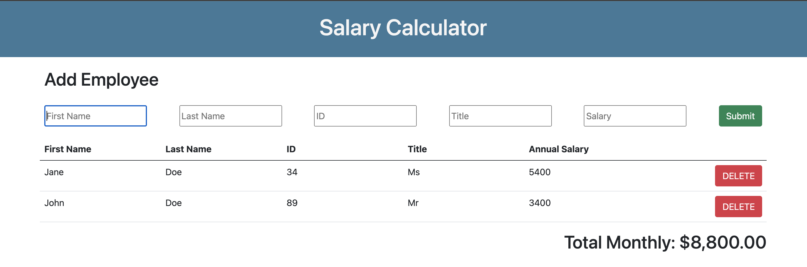

# jQuery Salary Calculator

## Description

Duration: Weekend Coding Project

This application records employee details, calculates the total monthly cost of their salaries, and displays it in a table on the page. Users can remove employees by clicking on their associated delete button; this will update the total monthly costs and the table in the browser window.

If the total monthly costs of employees' salaries exceeds $20,000, the "Total Monthly" and dollar amount at the end of the table will display a red background.

Behind the scenes, the information is stored in an array, with each employee being assigned a unique ID (regardless of the ID entered by the user).

## Screenshot

## Usage

1. Enter all the detail of the employee in the input provided input fields and click enter on the submit button.
2. To delete an employee that has already been added to the list, click on the red delete button next to the row in which the employee is listed.

## Built With

- HTML
- CSS
- JavaScript
- jQuery
- Bootstrap

## Acknowledgement

Thanks to [Prime Digital Academy](www.primeacademy.io) who equipped and helped me to make this application a reality. Thanks to the Solinas cohort for bouncing around ideas.
